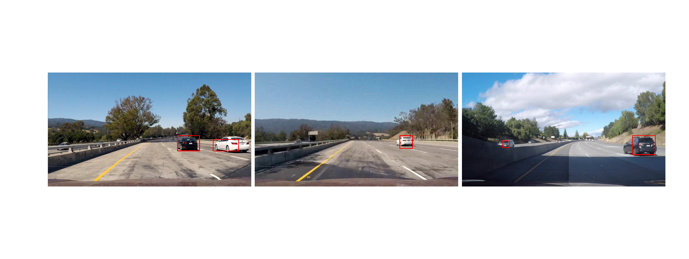
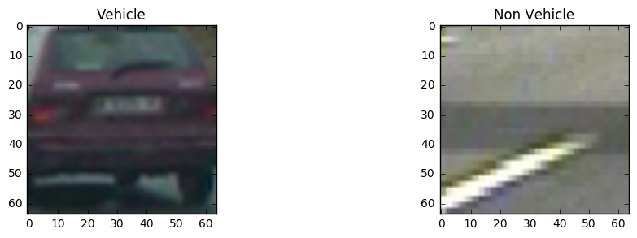
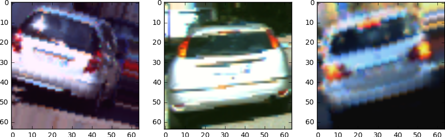
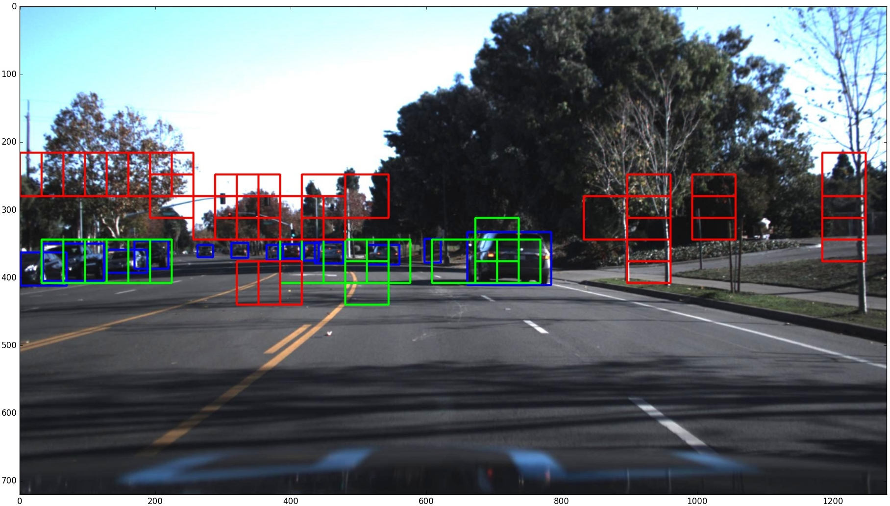
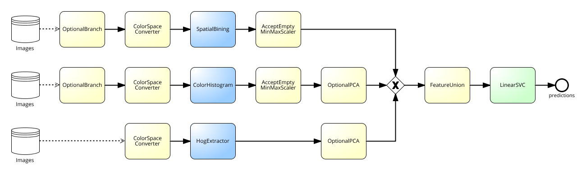
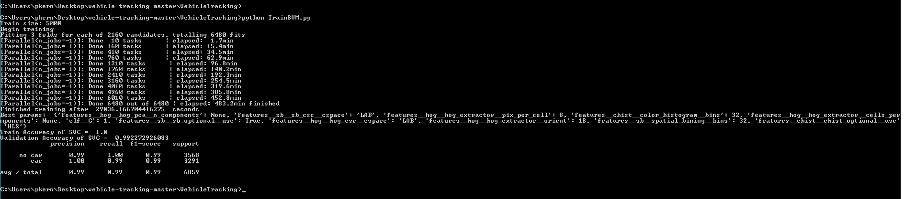
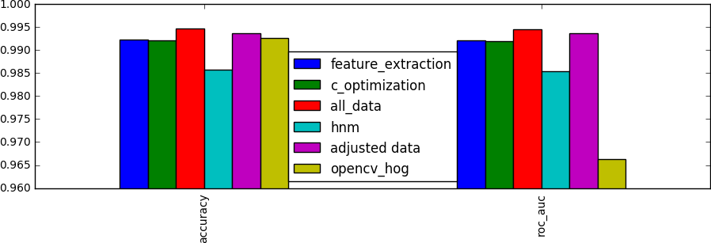
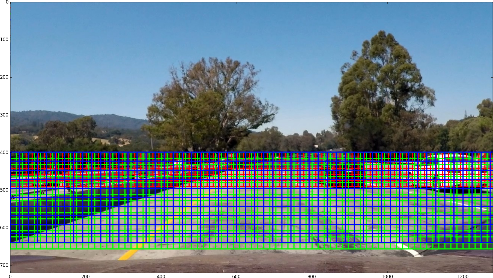
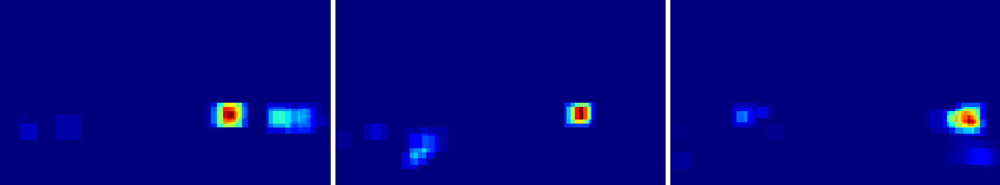
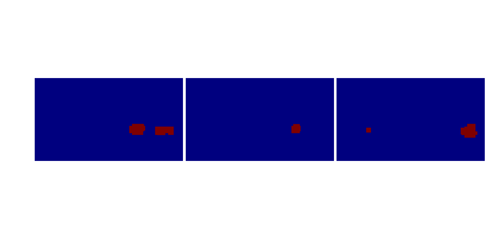

# Vehicle Detection
This project was created as an assessment for the Self-Driving Car Nanodegree Program by Udacity. The goal is to detect and track vehicles on images and videos using classical computer visions techniques. 

# Result

## Images

## Video

# Vehicle Classifier
In this section, I will describe the steps of implementing the vehicle detection model. The model building process was not sequential in the way it is described here. Instead, it was a highly iterative and experiment-driven process. 

## Data
The basic dataset was supplied by Udacity and contains images from the  GTI vehicle image database, the KITTI vision benchmark suite, and examples extracted from the project video itself. All the images are labeled and belong to one of two classes. “Vehicle” containing 8792 samples and “Non Vehicle” containing 9497 samples. 

At first, the data set was preprocessed in a Jupiter notebook to make it easier to work with. In this step, all the images were flipped along the y-axis to increase the data size. Also, the dataset was split into a train (20574), validation (6859) and test (9145) set for evaluation purposes.
Later the training set was modified again to account for classification deficits of white cars. For that, another Jupiter notebook was used to analyses the mean pixel intensity distribution of vehicle images. Images having high mean intensity were copied, slightly augmented and added to the dataset to balance the distribution. This resulted in a final training set size of 23053 images.

To reduce the number of false positives, the optimized model was used on Udacitys object detection crowd ai dataset, collecting image patches wrongly classified as vehicles. This process is called hnm which is short for hard negative mining. It generated 4740 additional images which were added to the training set for retraining the model. Unfortunately, it was not able to further improve the quality of the model which is why the hnm data was not used for training the final model. 

## Feature engineering
Finding the right features with the right parameters is a challenge itself. To simplify this process, the feature extraction was realized as a sklearn pipeline which allows to automatically tune parameters through a grid search.  Three different feature types were evaluated including HOG, color histogram and also spatial binning. For each of them, a custom transformer class was implemented to be used as part of a pipeline. Additional transformers were implemented to make the color histogram and spatial binning optional and to optimized the color space. Before merging the features they were all scaled to a range between 0 and 1 to prevent feature domination. A complete overview of the feature extraction pipeline can be found in the image below.

After training, the pipeline could directly be used to extract features from image patches. However, to improve performance, operations like color space transformation and HOG extraction are applied on the complete image instead of each individual patch during prediction. Therefore, that part had to be reimplemented in the detection component.

## Parameter optimization
To keep the parameter space manageable, the grid search was executed in steps. On a first run, a Linear SMV with default parameter was used to find the best feature combination out of 2100. After that, a second run was performed to optimize the C parameter of the Linear SMV using the previously determined features. On every run, a 3 fold cross validation was used to find the optimal combination. The score used was AUC.

## Evaluation
The results of different experiments were compared in a Jupiter notebook to get a clear overview over thinks that worked and thinks that didn't. As main metric AUC (Area Under Curve. In this case ROC curve) was used since the distribution of vehicle and non-vehicle images were not always balanced in all the experiments. The score was calculated using the validation set. The final model was then retrained on the training and validation set and evaluated with the test set to get an estimate of its performance.  This score, therefore, can’t directly be compared to the experiment scores.

# Image/Frame Processing Pipeline
## Sliding Window
The system was designed to allow the definition of multiple search areas, each with different stride, size, and padding. Each search area can be processed in a different thread to improve performance. The image below shows the used search areas.

## Heatmap
For each positive prediction, the value of the decision function is added onto a heatmap in the area of the bounding box. When processing a video the heatmap is averaged over 8 frames to smoothen resulting bounding boxes. Before extracting the bounding boxes a gaussian blur is applied to the heatmap to reduce noise. To remove false positives the heatmap is then thresholded. 

## Bounding Boxes
There are multiple ways of generating bounding boxes out of a heat map which varies in speed and quality. To find a suitable technique four different approaches were tested and compared in a Jupiter notebook. In the end, findContour from openCV seemed to be the best choice since it had high quality while outperforming all the other techniques in regards to speed by orders of magnitude.

# Discussion
To get good results on the project video many parameters were manually fine-tuned based on the project video results.  It can be assumed that the algorithm is over-fitted on the specific video and thus won’t yield as smooth results on videos with different lighting conditions and also other sceneries like cities.

It is also based on the assumption of a fixed horizon. Therefore a steep hill will like cause trouble.

Furthermore, vehicles with a high-speed difference to camera won’t be tracked correctly based on the fact that detections are averaged over several frames. So the detection boxes would lag behind the visible vehicle.
